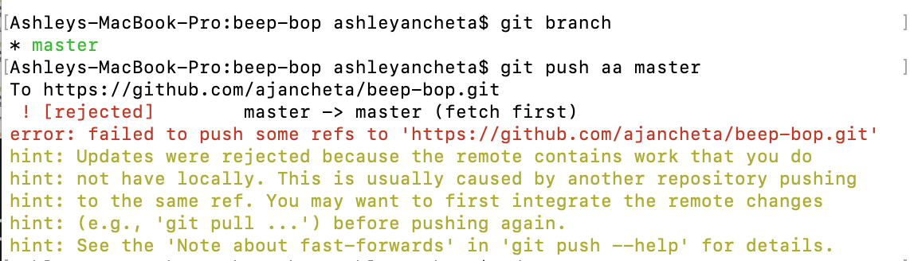

# _Beep Boop_

#### _Intro to Programming, Week 3 Independent Project, 04.05.2019_

#### By _Ashley J. Ancheta_

## Description
_This application will allow the user to submit a number. Based on the values from 0 to the number that they will input, there will be elements that will replace some of the values due to various conditions. Concepts such as arrays and loops from Week 3 of introduction to programming were applied to build this program._

## Specs
| Behavior | Input | Output |
| ------------- |:-------------:| -----:|
| Recognize that the user input is a number | a | NaN |
| Program will return a range of numbers from 0 to the input number | 3 | 0, 1, 2, 3 |
| The program with replace the value with a respective element from the number zero to the number that is submitted by the user. | 10 | "0, Beep!, Boop!, I'm sorry Dave, I'm afraid I can't do that, 4, 5, 6, 7, 8, 9, Beep! |
| The program will prompt the user to submit their name so that it will appear on the webpage when a function is executed | 15 | "0, Beep, Boop, I'm sorry Dave, I'm afraid I can't do that, 4, 5, 6, 7, 8, 9, Beep, Beep, Beep, Beep, Beep, Ashley, you found a number divisible by 15!" |

## Setup/Installation Requirements

* Go to this link to view the page on GitHub "https://ajancheta.github.io/beep-boop". You may also clone this repository "https://github.com/ajancheta/beep-boop.git"
* Open the repository in a preferred text editor such as Atom.
* Open the file and view in the web browser of preference.

## Known Bugs

_There are no known bugs._

## Commit History

_Due to complication with git earlier today, below are screen shots of what I was receiving on my terminal as well as commits that are on shown on my GitHub. _

## Support and contact details

_Should any problems occur, discover other bugs, or experience issues with viewing, please contact me at ashleyjancheta@gmail.com_

## Technologies Used

_This webpage was written in HTML. Style was created using Bootstrap and a custom style page. Effects were implemented using JQuery library and a custom JavaScript page._

### License

*This software is licensed under MIT license.*

Copyright (c) 2019 **_Ashley J. Ancheta_**
